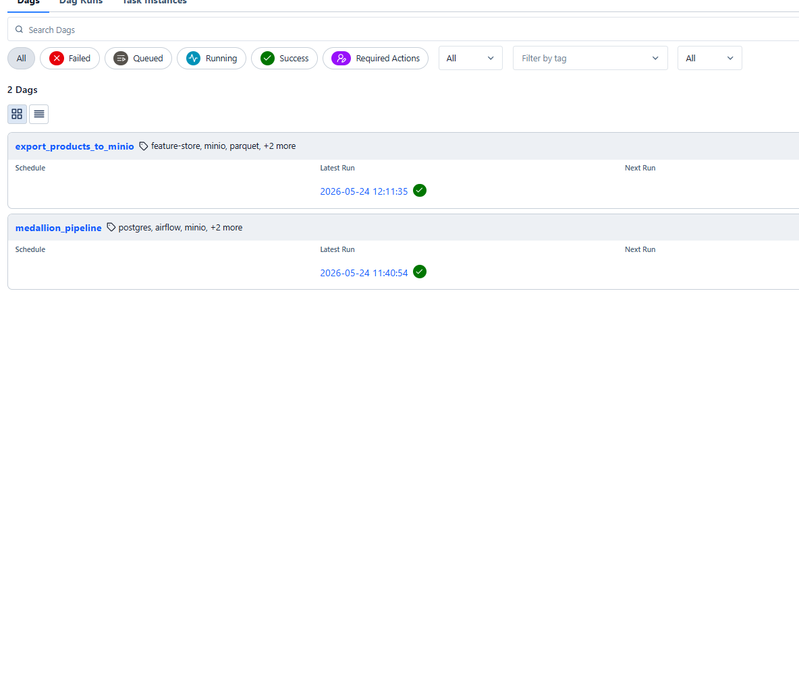
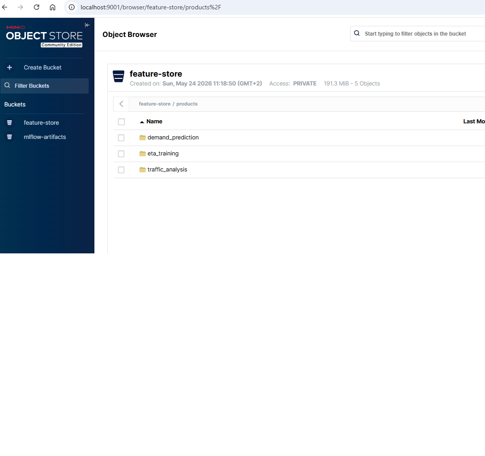

# BGD_projekt

## Cel zadania 
Celem projektu jest zaprojektowanie i implementacja skalowalnego pipeline’u przetwarzania danych NYC Taxi, który przekształca surowe dane przejazdów taxi w wysokiej jakości model analityczny (warstwa GOLD) oraz produkty danych wykorzystywane do analizy ruchu miejskiego i uczenia maszynowego.

## Dane
Dane posidają następujące kolumny 

- id – identyfikator kursu
- vendor_id – identyfikator przewoźnika
- pickup_datetime – czas rozpoczęcia kursu
- dropoff_datetime – czas zakończenia kursu
- passenger_count – liczba pasażerów
- pickup_longitude – długość geograficzna pickup
- pickup_latitude – szerokość geograficzna pickup
- dropoff_longitude – długość geograficzna dropoff
- dropoff_latitude – szerokość geograficzna dropoff
- store_and_fwd_flag – flaga przechowania danych
- trip_duration – czas trwania kursu w sekundach

## MinIO Data Lake

Struktura MinIO została podzielona na:

raw/ – przechowuje surowe dane wejściowe NYC Taxi w formacie CSV,
products/ – przechowuje gotowe produkty danych wygenerowane przez pipeline.

Folder products/ zawiera trzy produkty:

- eta_training
- demand_prediction
- traffic_analysis

Każdy produkt jest eksportowany jako plik Apache Parquet data.parquet i wersjonowany po dacie eksportu export_date=YYYY-MM-DD

## Pipeline medallion_pipeline_dag.py

Pipeline medallion_pipeline jest zaimplementowany jako DAG w Airflow.

Pipeline wykorzystuje MinIO jako storage typu S3-compatible.

Pipeline odpowiada za pełne przetwarzanie danych NYC Taxi od surowego pliku CSV do analitycznej warstwy GOLD.

Pipeline ma trzy taski.

RAW Ingestion – raw_ingestion()

Cel: przechowywanie surowych, historycznych danych (append-only)

- Pobiera plik CSV z MinIO

Domyślnie używa:
s3://feature-store/raw/taxi1.csv

Umożliwia wybór pliku z GUI Airflow:
"file": "raw/taxi1.csv"

Parametr load_mode określa sposób przetwarzania danych w pipeline i pozwala przełączać się pomiędzy trybem przyrostowym (incremental) oraz pełnym (full).

"load_mode": "incremental"

- Wczytuje dane w partiach (chunkach)
- Oblicza hash pliku i sprawdza, czy ten sam plik został już wcześniej załadowany
- Ładuje tylko nowe pliki, dzięki czemu unika ponownego przetwarzania tych samych danych
- Nadaje każdej partii danych numer batcha (batch_no)
- Dodaje metadane source_file, file_hash, loaded_at
- Zapisuje dane do tabeli raw.transactions_raw
- Rejestruje załadowany plik w tabeli raw.ingestion_log

Cechy:

- append-only
- pełna historia danych
- możliwość audytu i ponownego przetwarzania
- incremental ingestion

Cleaned and validated data – silver_build()

Cel: oczyszczone i zwalidowane dane

- Odczytuje dane z warstwy RAW przy użyciu Apache Spark i JDBC
- Przetwarza tylko nowe batch’e (na podstawie silver.batch_log)
- Czyści i normalizuje dane
- Wykorzystuje Spark DataFrame API do skalowalnego przetwarzania danych
- Zapisuje dane do silver.transactions_clean
- Używa mechanizmu UPSERT (ON CONFLICT DO UPDATE) na kluczu id
- Rejestruje przetworzony batch w tabeli silver.batch_log

Cechy:

- przetwarzanie inkrementalne
- idempotentność
- brak duplikatów
- skalowalne transformacje z użyciem Spark

Analytical Modeling – gold_build()

Cel: dane gotowe do analizy i raportowania

- Buduje model analityczny gold.dim_vendor, gold.dim_date, gold.fact_trips

Logika działania:

- Uwzględnia tylko poprawne dane (is_valid = true)
- Stosuje deduplikację danych
- Wszystkie tabele ładowane są przez UPSERT (ON CONFLICT DO UPDATE)
- Tabela faktów zawiera jeden rekord na id

Cechy:

- model analityczny
- star schema
- brak duplikatów
- możliwość aktualizacji danych

## Pipeline export_products_to_minio_dag.py

Pipeline export_products_to_minio jest zaimplementowany jako osobny DAG w Airflow.

Pipeline odpowiada za eksport produktów danych z warstwy GOLD do plików Parquet w MinIO.

Umożliwia konfigurację z GUI Airflow:
"max_rows": 5000
dla -1 - pobierz wszystkie rekordy.

Pipeline eksportuje produkty:

- gold.eta_training
- gold.demand_prediction
- gold.traffic_analysis

Export produktów – export_product()

Cel: eksport produktów danych do MinIO jako pliki Parquet

- Odczytuje dane z widoków GOLD
- Domyślnie eksportuje maksymalnie 1000 rekordów
- Pobiera dane z PostgreSQL przy użyciu Pandas
- Zapisuje dane lokalnie jako plik .parquet
- Wysyła plik do MinIO przy użyciu Boto3
- Automatycznie tworzy strukturę:
- products/<product_name>/export_date=YYYY-MM-DD/data.parquet

Cechy:

- eksport danych w formacie Apache Parquet
- integracja PostgreSQL → MinIO
- możliwość konfiguracji liczby rekordów
- automatyczne wersjonowanie po dacie eksportu
- produkty gotowe do ML i analytics

## Uruchomienie
docker compose -f pipeline_docker.yml build

docker compose -f pipeline_docker.yml up

## Obis produktów : feature_store_project_summary.docx

## Przykład produktu w parquet data.parquet

## Pipelines

## Produkty w Minio
